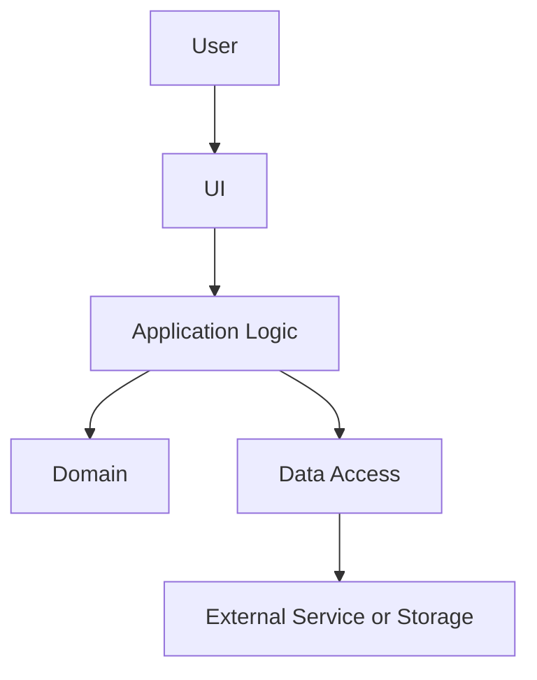
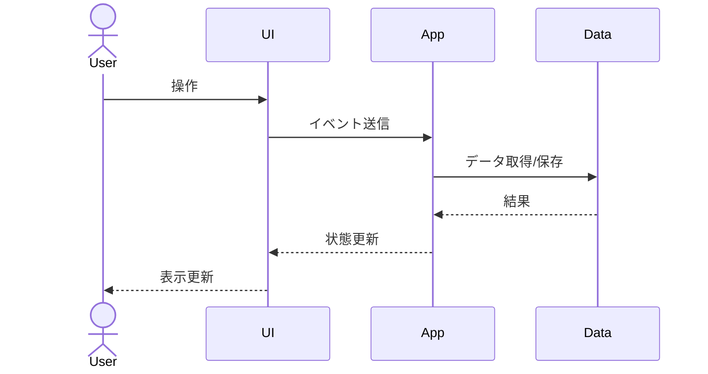
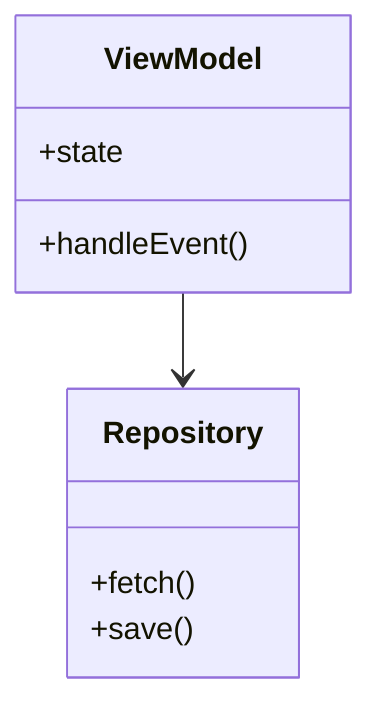
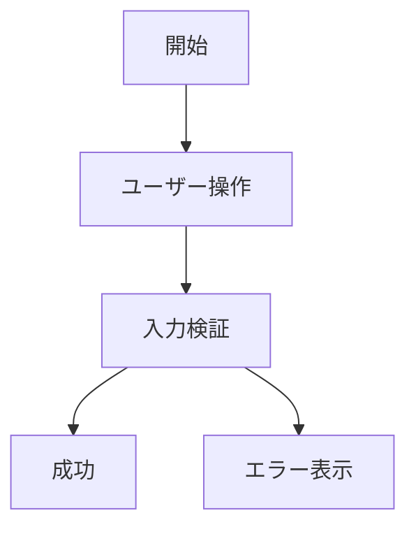
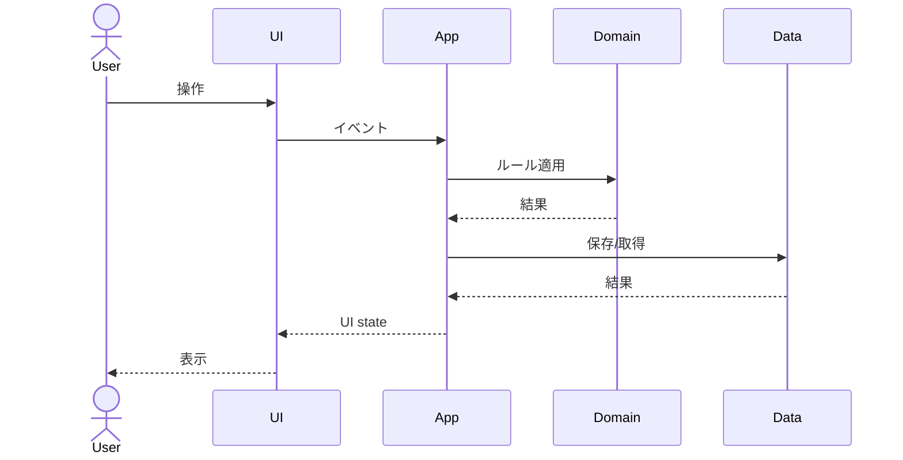

# Harness Design Skill

要件をもとに、実装前にレビュー可能な設計書を作成する。

## 入力

- ユーザーの要件
- 既存コード、既存ドキュメント、制約条件
- 必要に応じた Web 調査結果

## 出力

設計書の正本を `docs/sekkeisyo/sekkeisyo-<run-id>.md` に作成する。

可能であれば、ユーザー操作やユースケースごとの処理の流れを `docs/usecase/usecase-<run-id>.md` に作成する。

ドキュメントの保存と命名は `docs/harness/document-storage.md` に従う。

Obsidian はコピー先として扱い、必要に応じて `<Obsidian Vault>/<ProductName>/docs/` にコピーする。

`<run-id>` は `YYYYMMDD-HHmm-<topic>` とする。

例: `20260620-1430-user-auth`

## 手順

1. 要件、制約、既存構成を確認する。
2. `docs/harness/quality-gates.md` の Requirement Gate で要件の明確さを確認する。
3. 不明点が設計品質に大きく影響する場合だけ、ユーザーに質問する。
4. 必要に応じて Web 調査を行い、主要な設計パターン、ライブラリ、制約を確認する。
5. 設計案を作成する。
6. Mermaid で、全体フロー、主要シーケンス、必要に応じたクラス図を作成する。
7. 俯瞰的な全体説明から、個別機能、ロジック、データ、エラー処理へと、大きな構造から小さな詳細に降りる構成にする。
8. 可能であれば、ユーザー操作ごとの処理の流れを `docs/usecase/usecase-<run-id>.md` にまとめる。
9. 設計の代替案、採用理由、未解決事項、リスクを明記する。
10. UI を含む場合は `.claude/skills/ui-design/SKILL.md` を実行し、`docs/ui/ui-<run-id>.md` を作成する。
11. 次に `harness-review` で設計レビューを行うよう案内する。
12. 設計レビュー後、タスク分解では `.claude/agents/task-planner-reviewer.md` を使い、並列実装できる wave と task 境界を明確にする。

## 設計書フォーマット

```md
# Design: <title>

## 目的

## 要件

## 非目標

## 前提・制約

## 全体像

システム、ユーザー、外部サービス、主要コンポーネントの関係を説明する。



## 既存構成の観察

## 提案アーキテクチャ

## 主要フロー

主要な処理の流れを、ユーザー操作またはシステムイベントを起点に説明する。



## ファイル構成

## コンポーネント・クラス構造

必要に応じて、主要クラス、型、責務、依存関係を Mermaid class diagram で示す。



## データモデル・状態管理

## API・インターフェース

## 機能別詳細設計

大きな機能単位ごとに、責務、入力、出力、主要ロジック、失敗時の扱いを説明する。

## エラーハンドリング

## セキュリティ・権限

## テスト方針

## 移行・ロールアウト

## 代替案

## リスク

## Open Questions
```

## ユースケース資料フォーマット

`docs/usecase/usecase-<run-id>.md` には、ユーザー操作によって何が起きるかをユースケースごとに書く。

```md
# Use Cases: <title>

## UC-001: <use case title>

### ユーザーの目的

### 事前条件

### 操作フロー



### シーケンス



### 正常系

### 異常系

### 関連する設計要素
```

## 方針

- 設計は実装者が迷わない粒度にする。
- 既存のアーキテクチャ、命名、ファイル構成を優先する。
- 一般論ではなく、対象プロジェクトでどうするかを書く。
- 調査結果を使った場合は、設計書に参照元と採用理由を残す。
- 過剰設計を避け、将来の拡張点は必要な範囲に限定する。
- 設計書は、全体像から詳細へ自然に読める構成にする。
- Mermaid の flowchart、sequenceDiagram、classDiagram を必要に応じて使い、文章だけでは追いにくい関係や流れを可視化する。
- ユースケース資料では、ユーザー操作を起点に、UI、アプリケーションロジック、ドメイン、データ保存、外部サービスまでの流れを示す。
- 過去の設計書を上書きせず、設計ごとに新しい `<run-id>` で蓄積する。
- ファイル名には日時だけでなく短い topic を含める。
- UI を含む案件では、UI 設計書 `docs/ui/ui-<run-id>.md` を必ず作成する。
- UI 非対象の場合は、設計書に理由を明記する。
