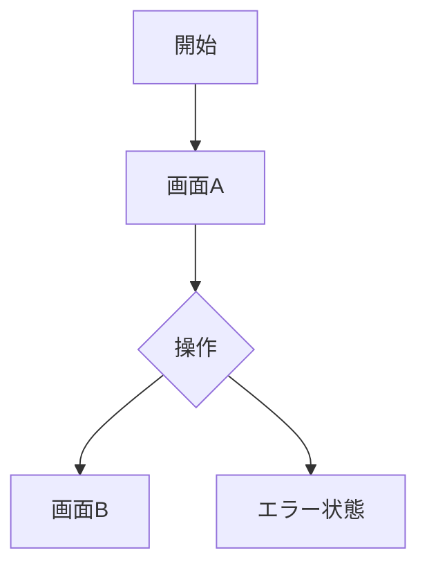

# UI Design Skill

ユーザー向け UI を含む設計で、実装とレビューに使える UI 設計書を作成する。

## Trigger

- 「UI設計して」
- 「画面設計して」
- 「設計時にUI設計もして」
- 「UI設計書を作って」

## Output

`docs/ui/ui-<run-id>.md`

`<run-id>` は設計書と同じ `YYYYMMDD-HHmm-<topic>` を使う。

## Inputs

- `docs/sekkeisyo/sekkeisyo-<run-id>.md`
- `docs/usecase/usecase-<run-id>.md` があれば含める
- 対象プラットフォームと既存 UI
- デザインシステム、ブランド、アクセシビリティ要件

## Workflow

1. 対象ユーザー、主要ユースケース、利用環境を確認する。
2. 画面一覧と画面間遷移を整理する。
3. 各画面の目的、情報優先度、操作、状態を定義する。
4. 正常、空、読み込み、エラー、権限不足、オフラインなどの状態を定義する。
5. コンポーネント構造と再利用境界を定義する。
6. アクセシビリティ、レスポンシブ、プラットフォーム慣習を定義する。
7. Mermaid でユーザーフローと画面遷移を可視化する。
8. UI 設計書を作成し、設計書と相互リンクする。

## UI Design Document Format

```md
# UI Design: <title>

## 関連資料

- [設計書](../sekkeisyo/sekkeisyo-<run-id>.md)
- [ユースケース](../usecase/usecase-<run-id>.md)

## 対象ユーザーと利用環境

## UI全体方針

## 画面一覧

## ユーザーフロー



## ナビゲーション

## 画面別設計

### Screen 1: <name>

#### 目的

#### 表示情報と優先度

#### 操作

#### 状態

- Loading
- Empty
- Content
- Error
- Disabled / Permission denied

#### バリデーションとフィードバック

#### アクセシビリティ

## コンポーネント構造

## デザインシステムとの対応

## レスポンシブ・端末差分

## アニメーションとフィードバック

## UIテスト観点

## Open Questions
```

## Rules

- 既存デザインシステムとプラットフォーム慣習を優先する。
- UI を含む案件では、UI 設計書を省略しない。
- API やデータが未確定でも、必要な UI state と error state は明示する。
- 見た目だけでなく、操作、状態遷移、アクセシビリティ、検証方法まで設計する。
- UI を持たない backend / batch / library では、UI 非対象の理由を設計書に記録して省略できる。

